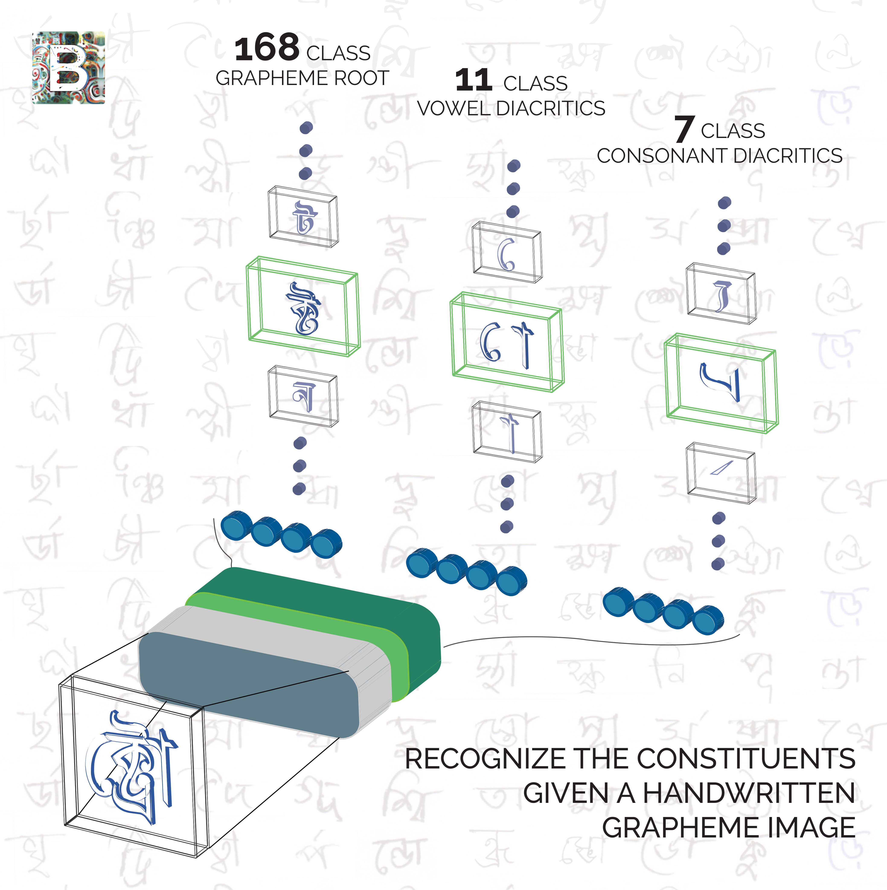
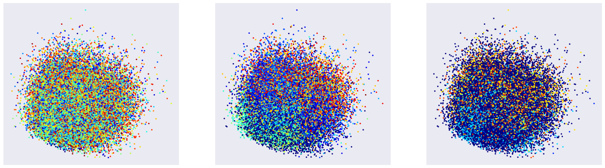
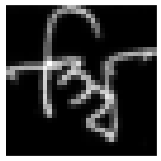
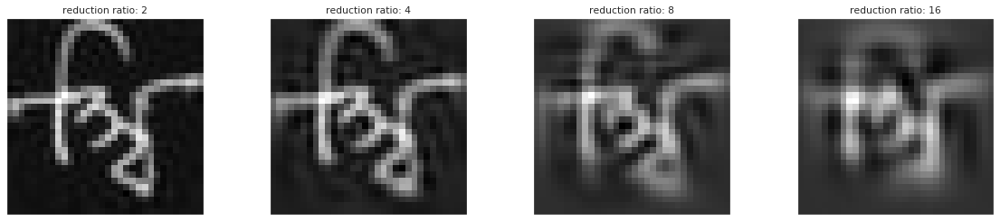
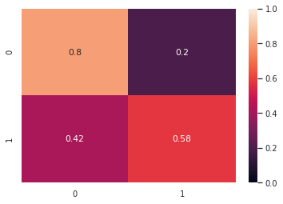
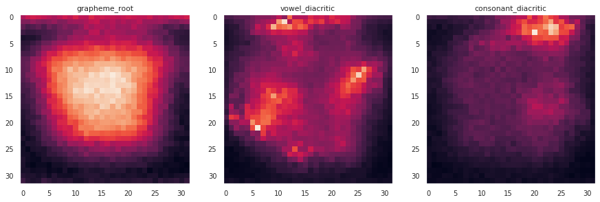
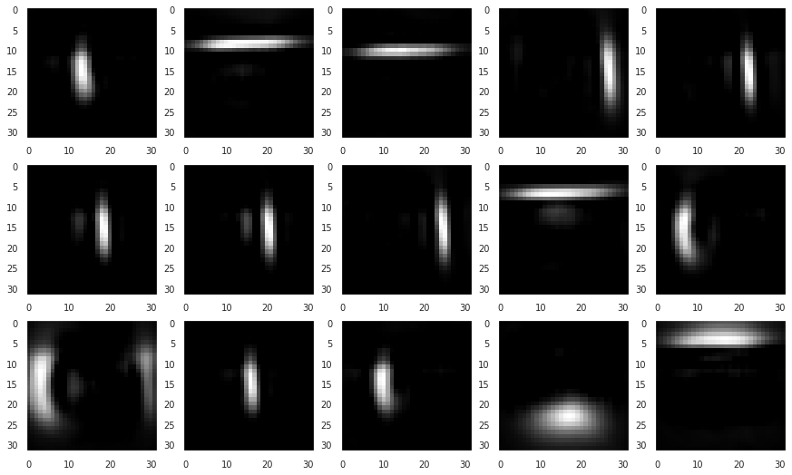
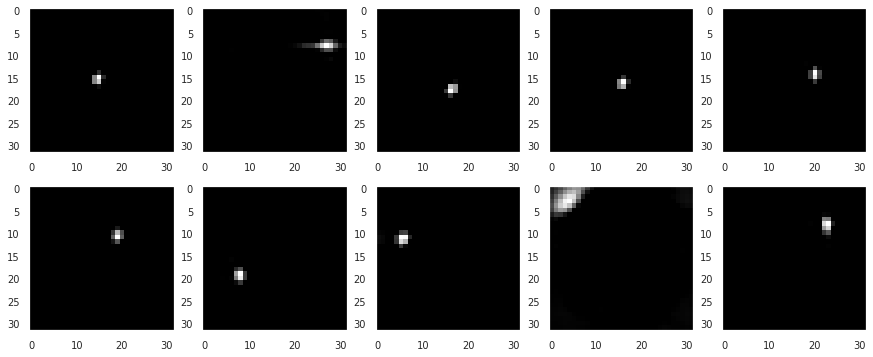
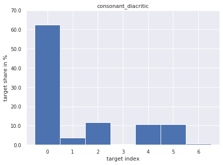
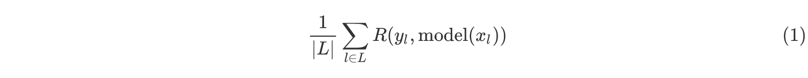

# Report: Bengali character recognition

<figure>

</figure>

> Bengali characters consist of three components

This dataset contains images of hand-written Bengali characters. Bengali characters (graphemes) are consisted of three components: a grapheme_root, vowel_diacritic, and consonant_diacritic. The challenge is to classify the components of the grapheme in each image. There are roughly 10,000 possible graphemes, of which only a part is represented in the training set. 

#### Preprocessing

There is around 200000 images in the training set, each with resolution 137 x 200. In this resolution, most of the image is empty and the letter is often in the corner, so we cut out 128 x 128 image of it, resizing if necessary to keep the letter in the image. To make experiments faster, we decide on resizing images to size 32 x 32. This is not the case in neural network section, since neural networks work better in higher resolution.

## Data presentation

> Presentation of data samples with three target classes

### Target statistics

> Distribution of classes for each target. Some classes are highly underrepresented

Not only classes are unbalanced, but also different targets combination gives different character. One could conclude that some of triplets are extremally rare and absent in training set. We will check if this is the case.

### How many unique combination are there?

    number of different combinations: 1292
    mode: (167, 7, 0) with 68 occurences
    least common: (72, 9, 2) with 12 occurences

Surprisingly, the least common class is not that rare at all.

### Presentation of the mode

> Presentation of samples from the most common set of classes. Clearly, images from the same class can look very different.

## Data compression

> Presentation of data reduced using PCA. Each figure shows a different target.

Such extreme (from 1024 to 2 dimensions) does not preserve much information (if any). We will analyze, how many dimensions we need to keep most of the variance.

### Image reconstruction from PCA

#### Original Image

#### Reconstructions

> Images after PCA reconstruction for different dimensionality reduction ratios

#### Variance analysis

We can see that data can be reduced twice without losing much variance, but further reduction might be losing the variance. We will perform variance analysis to check exactly how much variance we lose.

    component:    1, explained variance: 3.758 %
    component:    2, explained variance: 7.338 %
    component:    3, explained variance: 10.373%
    component:    4, explained variance: 12.993%
    component:    5, explained variance: 15.513%
    component:    6, explained variance: 17.868%
    component:    7, explained variance: 20.158%
    component:    8, explained variance: 22.272%
    component:    9, explained variance: 24.056%
    component:   10, explained variance: 25.719%
    component:   20, explained variance: 38.371%
    component:   30, explained variance: 46.573%
    component:   40, explained variance: 53.068%
    component:   50, explained variance: 58.338%
    component:   60, explained variance: 62.706%
    component:   70, explained variance: 66.391%
    component:   80, explained variance: 69.542%
    component:   90, explained variance: 72.280%
    component:  100, explained variance: 74.660%
    component:  200, explained variance: 88.297%
    component:  300, explained variance: 93.951%
    component:  400, explained variance: 96.758%
    component:  500, explained variance: 98.280%
    component:  600, explained variance: 99.130%
    component:  700, explained variance: 99.599%
    component:  800, explained variance: 99.845%
    component:  900, explained variance: 99.960%

As we can see, we were right and we need around 500 dimensions to keep most of the variance.

### t-SNE visualization

> t-SNE visualization of the data. The marked target is vowel diacritic.

Such visualization can hardly give us satisfying results, since we have 3 different classes in the dataset. But we finally see that some the classes are separated.

## Classic approaches to classification

### K Nearest Neighbors

kNN on PCA-reduced datapoints. We will consider each target separately. First, we try to predict the first target – grapheme root. With 168 different classes, it’s the most difficult one. We will look at two metrics - accuracy score and macro recall, which is just an arithmetic mean of recall scores calculated for each class. While the accuracy metric attaches more significance to more represented classes, macro recall treats every class – even underrepresented – as equally important.

    1-NN accuracy:  11.33%
    1-NN macro recall: 10.81%
    3-NN accuracy:   9.47%
    3-NN macro recall: 8.73%
    7-NN accuracy:  10.83%
    7-NN macro recall: 8.83%
    11-NN accuracy:  11.80%
    11-NN macro recall: 9.06%
    17-NN accuracy:  12.65%
    17-NN macro recall: 8.59%
    29-NN accuracy:  12.98%
    29-NN macro recall: 7.93%

We can see that increasing the value of k tends to increase the accuracy and decrease the macro recall. This suggests that the model performs better on samples from more represented classes while performing worse on other samples. This is consistent with our intuition of data points having more neighbors from overrepresented classes.

Next, we check the vowel diacritic target.

    1-NN accuracy:  53.94%
    1-NN macro recall: 44.65%
    3-NN accuracy:  56.70%
    3-NN macro recall: 41.89%
    7-NN accuracy:  60.88%
    7-NN macro recall: 44.60%
    11-NN accuracy:  62.06%
    11-NN macro recall: 44.67%
    17-NN accuracy:  62.70%
    17-NN macro recall: 44.13%
    29-NN accuracy:  62.79%
    29-NN macro recall: 43.08%

The decrease in the number of classes allowed our model to be much more effective, although the effects of class imbalance are still visible.

Finally, we check the consonant diacritic target. While it has the smallest number of possible classes, it suffers from severe class imbalance, with roughly 60% of training samples belonging to class 0.

    1-NN accuracy:  56.13%
    1-NN macro recall: 29.38%
    3-NN accuracy:  63.49%
    3-NN macro recall: 24.94%
    7-NN accuracy:  65.59%
    7-NN macro recall: 22.81%
    11-NN accuracy:  65.33%
    11-NN macro recall: 21.39%
    17-NN accuracy:  65.45%
    17-NN macro recall: 19.25%
    29-NN accuracy:  65.06%
    29-NN macro recall: 17.84%

We can observe a large difference between the two metrics, which, as before, tends to increase with an increase of k. Since now we are dealing with a small number of classes we can examine the confusion matrices.

> Confusion matrices for the kNN classifier with different values of k

While the recall value for class 0 reaches 94% for k=7, we can see that an increase of k caused the model to perform noticeably worse on samples from other classes. In fact, no samples from classes 3 and 6 were classified correctly in the latter case and every class has at least 70% of samples classified as belonging to class 0.

### SVM

We will start with a binary problem of distinguishing between the class 0 of the consonant diacritic target vs the other classes (i.e. detecting presence of a consonant diacritic).

    0    0.62375
    1    0.37625
    dtype: float64

The class ratio is 60% to 40% so the problem is rather balanced.

    Accuracy: 72.11%
    Macro recall: 69.20%

> Confusion matrix for an SVM detecting presence of a consonant diacritic

Since we're performing the calculations on a GPU the computation time wasn't bad. Next we try the full classification problems with the one-vs-one approach.

    Class 1
    Accuracy: 22.06%
    Macro recall: 15.56%
    
    Class 2
    Accuracy: 72.79%
    Macro recall: 62.99%
    
    Class 3
    Accuracy: 71.64%
    Macro recall: 38.52%

Overall, SVM performs better then kNN for all subproblems, for all tested values of k and for both metrics. We can also check the accuracy for the whole task.

    12.24%

### Random forest classification

Unlike the previous classifiers, we train the random forest classifier without dimensionality reduction. This will give us insight into the importance of each feature for each subproblem.

    grapheme_root accuracy: 8.59%
    grapheme_root macro recall: 4.08%
    vowel_diacritic accuracy: 60.77%
    vowel_diacritic macro recall: 42.03%
    consonant_diacritic accuracy: 70.29%
    consonant_diacritic macro recall: 24.25%

The classifiers' performance is comparable to that of kNN classifiers. We can now examine the feature importance scores.

> Importance scores calculated for each pixel using a random forest

We can see which parts of an image are of greatest importance for each of the subproblems. In particular, for grapheme root prediction the central part of the image seems to be most important, whereas diacritic predictions require more focus on the edges of a grapheme.

## Segmentation

Since Bengali characters are composed of parts which are to be classified in each of the subproblems, it seems natural to try to split the grapheme into its components to simplify each of the classification tasks. We'll begin by looking at the results of a nonnegative matrix factorization.

> Presentation of the components for a low rank NMF

Running NMF with a low rank allowed to approximately decompose the graphemes into a set of small components. We can try to increase the value of this parameter to potentially include all possible grapheme components, such as the diacritics.

> Presentation of the components for a higher rank NMF

Unfortunately, this method was unable to detect the desired features. This was expected since, as previously seen, samples from the same class can look very differently.

## Generating new examples of underrepresented classes

Simple method for segmentation of the components didn't work for us, but using classic, expert based approach we can modify some of the classes to get more training data. We will focus on the second class - consonant diactric, since there is only 7 different classes.

> Frequency of classes in consonant diactric in full dataset

From the histogram, we can see that targets 1, 3 and 6 are underrepresented, we will try and generate more of them.
* 1: ঁ
* 3: র্য
* 6: ্র্য

Looking at the letters, we can conclude that the first of these looks like it's easiest to separate from the rest of the letter, so we will focus on it. We will use heuristics designed for this specific class to show that it is possible to generate more training data for a class problematic for our model. The heuristics use following ideas:

* this particular class looks like a hat with a dot – two separate figures
* the hat is almost always in the upper part of the image
* diactric consists of two connected components
* two connected components are rather small and close to each other

The algorithm finds connected components and uses described heuristics. To present its working, we try to erase cap from images with cap. If the algorithm is able to find the cap, it is able to remove it from the picture in natural way. We can then add the cap to another image.

<figure>

</figure>

> Heuristics for removal of target 1 (hat) of consonant diacritic

Obviously, targets of modified images are modified as well. In this case, targets should be changed from 2 to 0, which means no consonant diacritic at all. We go further, and take the fragment of the image that was erased and put it in another image which has no consonant diactric at all.
We use additional heuristics:

* Add the fragment only if it is not overlapping with the rest of the letter
* Add the fragment only if pixel intensity (brightness) of the figure is similar between fragment and the rest of the letter
* Add the hat only to classes that naturally can have the hat (it was observed in the training set)

<figure>

</figure>

> Artificial data created using heuristics described above. The hat in the upper part of one image, and the rest of the letter was part of another image

The results look realistic. However, this is only 1 from 3 underrepresented classes in consonant diacritic. Later experiments showed that models do not have problems with recognizing this particular class, since this class recall was high anyway. So additional data of this class was not very important. We showed that, using data from the training set, it is possible to combine existing letters, generating new, artificial training data.

## Convolutional Neural Networks

**How good are nowadays neural networks for this task?**

Table shows error rates for different architectures and classes. Some of the models were trained with 3 outputs at once, some of them were trained only on grapheme root (the most difficult class). Performance in these approaches wasn’t statistically different.

Macro recall is metric used in the competition as the leaderboard metric and is defined as

for L being a set of possible targets and R being a function calculating vanilla recall. Grapheme root is twice as important as vowel diactric or consonant diactric for the competition leaderboard metric.

**Table of Results**

---

| Network          | version | parameters | g. root | v. diacritic | c. diacritic | macro recall |
| :--------------- | :-----: | :--------: | :-----: | :----------: | :----------: | :----------: |
| **ResNet 16-4**  |  base   |    2.7M    |  4.81%  |      -       |      -       |      -       |
| **ResNet 16-4**  |    B    |    2.7M    |  4.30%  |      -       |      -       |      -       |
| **ResNet 16-4**  |   B+C   |    2.7M    |  4.06%  |      -       |      -       |      -       |
| **ResNet 28-2**  |    C    |    1.6M    |  3.99%  |      -       |      -       |      -       |
| **ResNet 28-2**  |   C+D   |    1.6M    |  3.87%  |      -       |      -       |      -       |
| **ResNet 112-4** |   C+B   |   27.0M    |  3.23%  |      -       |      -       |      -       |
| **ResNet 16-4**  |    D    |    2.7M    |  4.28%  |    1.30%     |    1.32%     |    3.27%     |
| **ResNet 22-8**  |    D    |   17.2M    |  3.79%  |    1.10%     |    1.17%     |    2.91%     |

> Various ResNets performance. Following columns: grapheme root, vowel diactric and consonant diactric are percentage error rates and macro recall is the competition metric described above.
>
> **Description of versions:**
>
> * **B**: cutout was applied
> * **C**: training on crops (75% of image size), testing on whole
> * **D**: Generalized Mean Pooling instead of Average Pooling at the end of the network

Most of the experiments are focused on solving grapheme root prediction, since this is the most difficult and most important subtask in the competition. There are many ways to further improve the networks, but this section is intended to be just a sample of what neural networks are capable of. From the table we can infer the following:

* Deeper networks are better than wider
* Typical tricks, like cutout, work well

**Description of the models:**

We use widened ResNets (Wide ResNet). For example, in name "ResNet 28-2", 28 is the number of layers in the network, including convolutional shortcuts and dense layers and 2 is the widening factor with baseline width of 16-32-64 in consecutive parts of the network.

> Target and validation error rates during explanatory training for the grapheme root target. We see that the neural network is overfitting. This is the reason, why we explore regularization techniques

A few effective tricks that can further improve the training:

* Cosine or Hyperbolic Tangent Schedules
* Grid-Mask regularization (instead of cutout)
* Architectural modifications
* Label smoothing
