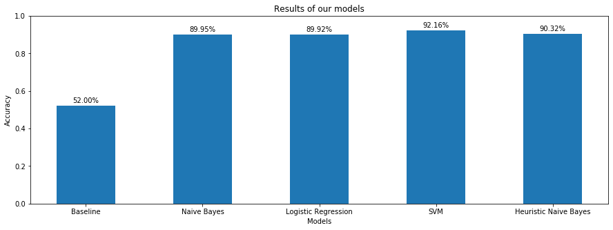

# Sentiment analysis
> Sentiment analysis based on movies reviews.

## Table of contents
* [General info](#general-info)
* [Technologies](#technologies)
* [Libraries](#Libraries)
* [Results](#Results)
* [Status](#status)
* [Inspiration](#inspiration)

## General info
The main goal of this project is to predict the sentiments of sentences.  
We work with IMDB movies reviews dataset. Movies are rated from 1 to 10. We consider only the reviews with rating 1 (the worst ones) and 10 (the best ones).  
The assumption is that movies with rating 1 have negative sentiment and movies with rating 10 have a positive sentiment.  

## Technologies
* Python - version 3.7.3

## Libraries
* numpy
* pandas
* matplotlib
* seaborn
* sklearn
* nltk
* scipy
* glob
* re
* cvxopt
* tqdm

## Results
* Accuracies below are measured on test data.
* Baseline accuracy: 52%.
* Naive Bayes: 89.95%.
* Logistic Regression: 89.92%.
* SVM: 92.16%.
* Heuristic Naive Bayes: 90.32%.

## Status
Project is: _finished_,

## Inspiration
Machine Learning class.

## Authors
Created by [@TheFebrin](https://github.com/TheFebrin), [@MatMarkiewicz](https://github.com/MatMarkiewicz) and [@gKlocek](https://github.com/gKlocek)
